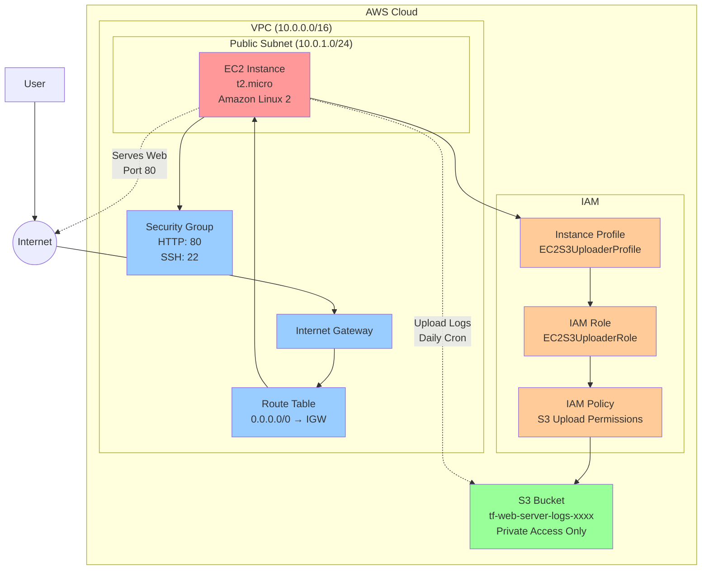
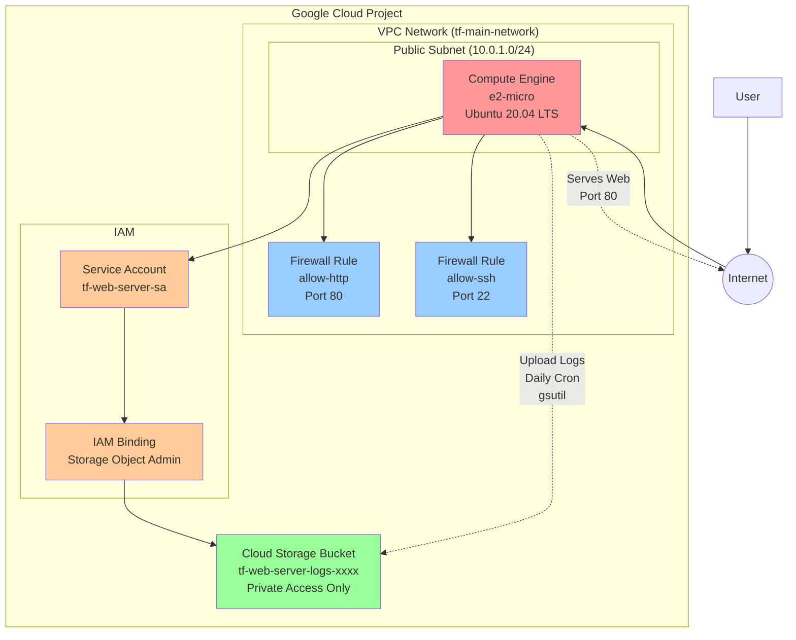
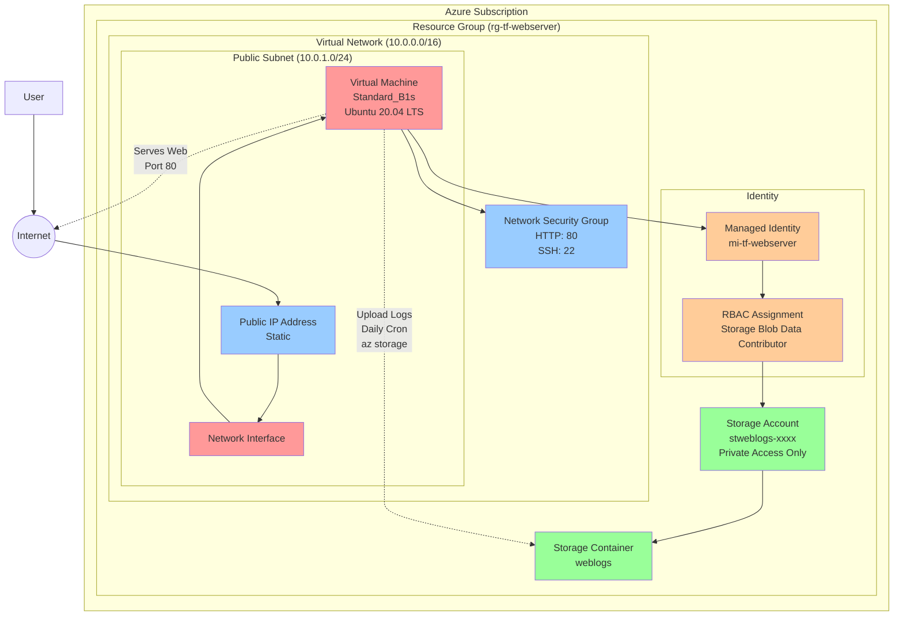
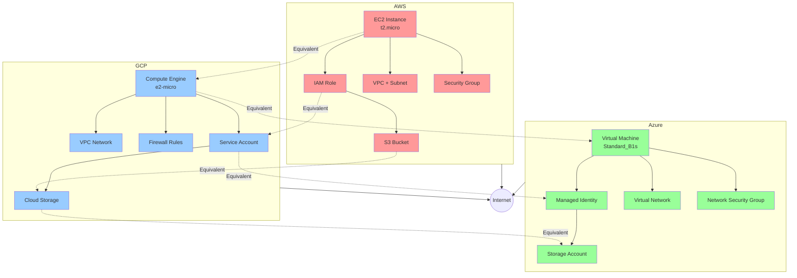
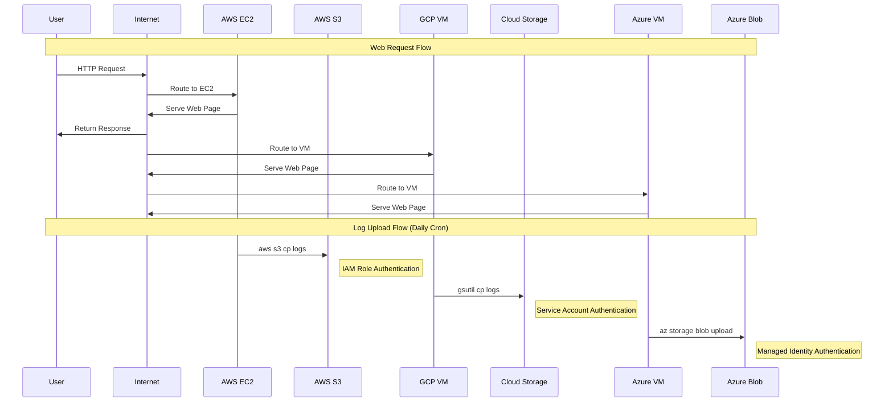

I'll create Mermaid.js diagrams representing the equivalent Terraform configurations for AWS, GCP, and Azure. These diagrams will show the infrastructure components and their relationships.

# AWS Infrastructure Diagram

# GCP Infrastructure Diagram

# Azure Infrastructure Diagram

# Multi-Cloud Infrastructure Comparison

# Data Flow Comparison Across Cloud Providers

## Component Mapping Table

Here's a quick reference table showing the equivalent components across cloud providers:

| Function | AWS | GCP | Azure |
|----------|-----|-----|-------|
| **Compute** | EC2 Instance (t2.micro) | Compute Engine (e2-micro) | Virtual Machine (Standard_B1s) |
| **Storage** | S3 Bucket | Cloud Storage Bucket | Storage Account + Container |
| **Network** | VPC + Subnet | VPC Network + Subnet | Virtual Network + Subnet |
| **Security** | Security Group | Firewall Rules | Network Security Group |
| **Identity** | IAM Role + Instance Profile | Service Account | Managed Identity |
| **CLI Tool** | AWS CLI | gcloud/gsutil | Azure CLI |
| **Auth Method** | IAM Role | Service Account | Managed Identity |
| **Region** | ap-south-1 | asia-south1 | East US |

These diagrams show how the same web server architecture with log uploading capabilities can be implemented across different cloud providers using their native services and authentication mechanisms.